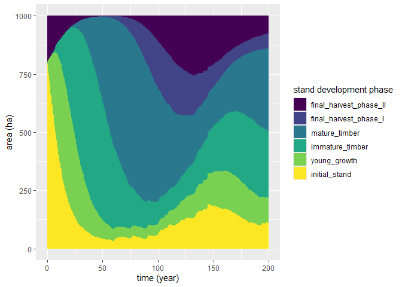
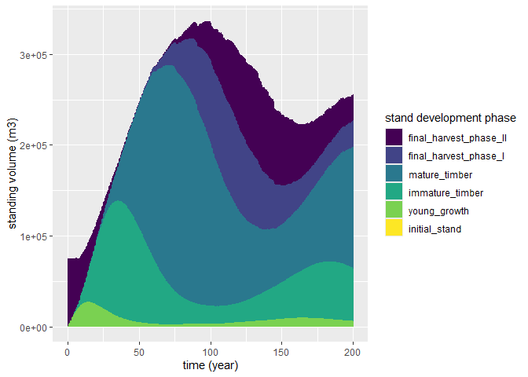
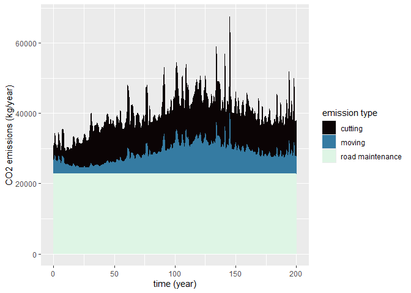

<!-- README.md is generated from README.Rmd. Please edit that file -->

# care4cmodel

<!-- badges: start -->

[](https://cran.r-project.org/package=care4cmodel)
[-blue.svg)](https://cran.r-project.org/web/licenses/GPL-3)
[](https://cran.r-project.org/package=care4cmodel)
<!-- badges: end -->

The goal of care4cmodel is to support comparisons of different
silcultural concepts on the forest estate level with a focus on the
CO<sub>2</sub> uptake by wood growth and CO<sub>2</sub> emissions by
forest operations. For achieving this, a virtual forest estate area is
split into the areas covered by typical phases of the silvicultural
concept of interest. Given initial area shares of these phases, the
dynamics of these areas is simulated. The typical carbon stocks and
flows which are known for all phases are attributed post-hoc to the
areas and upscaled to the estate level. CO<sub>2</sub> emissions by
forest operations are estimated based on the amounts and dimensions of
the harvested timber. Probabilities of damage events are taken into
account.

## Installation

In order to work with care4cmodel you require an installation of R
(version \>= 4.2.0) on your system. The installation files for R itself
are available [here](https://cran.r-project.org/). The released version
of care4cmodel can be installed from CRAN with:

``` r
install.packages("care4cmodel")
```

## Example

The following code demonstrates a basic example of how to use
care4cmodel:

``` r
library(care4cmodel)

# Run a simulation and store its base results in a variable sim_base_out
# call ?simulate_single_concept for details
sim_base_out <- simulate_single_concept(
    concept_def = pine_thinning_from_above_1, # use pre-defined concept
    init_areas  = c(800, 0, 0, 0, 0, 200),
    time_span   = 200,
    risk_level  = 3
)

# Evaluate the base results for carbon related information
# call ?fuel_and_co2_evaluation for details
carbon_out <- fuel_and_co2_evaluation(sim_base_out, road_density_m_ha = 35)
#> Joining with `by = join_by(phase_no, phase_name)`
#> Joining with `by = join_by(time, harvest_type, phase_no, phase_name)`
#> Joining with `by = join_by(time)`

# Plot results (check the documentation with ?plot.c4c_base_result, and
# ?plot.c4c_co2_result for all available options)
plot(sim_base_out) # Default plot: phase area development
```



``` r
plot(sim_base_out, variable = "vol_standing") # Plot standing volume
```



``` r
plot(carbon_out) # Default plot: CO2 emissions by emission type 
```



# More Information

For more information and details we suggest to call the package’s
vignette with:

``` r
vignette("getting-started-with-care4cmodel")
```

A detailed scientific article about the package has been published 2024
by the authors in *Computers and Electronics in Agriculture*. It is
available online [here](https://doi.org/10.1016/j.compag.2024.109091).
